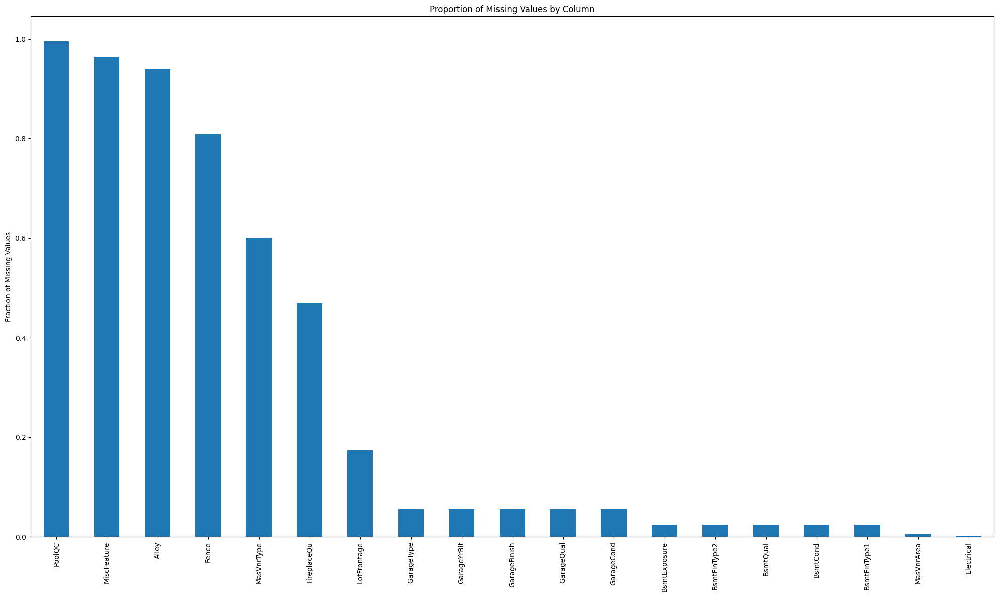
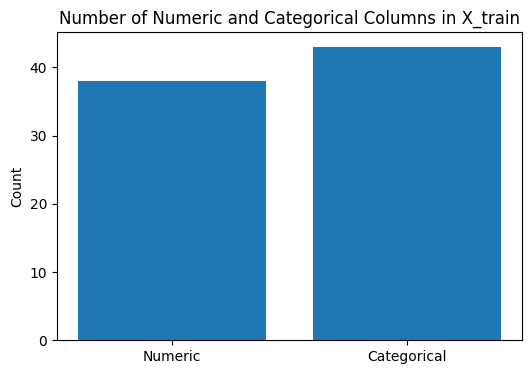
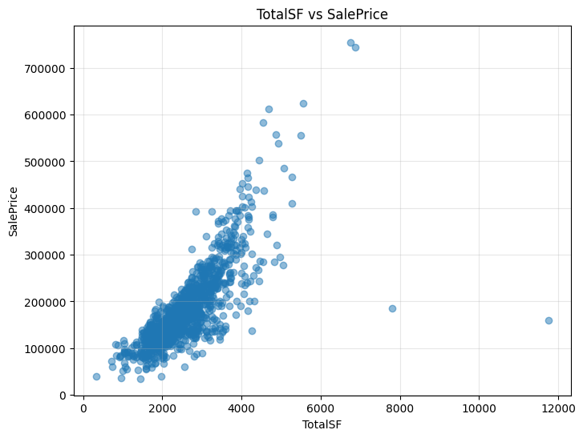
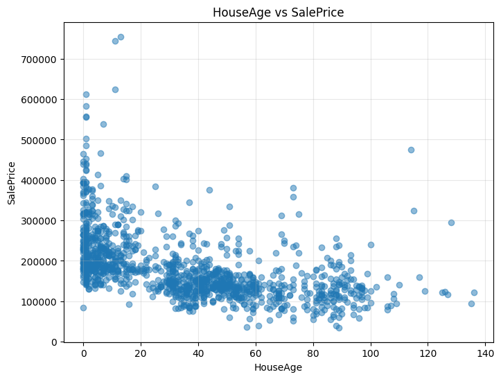
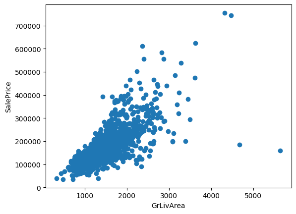

## House Prices - Advanced Regression Techniques

### კონკურსის მიმოხილვა
Kaggle House Prices კონკურსის მიზანია სახლების ფასის პროგნოზირება. ამისათვის გადმოგვეცემა სახლების ისეთი მახასიათებლები, როგორებიცაა სახლის ადგილმდებარეობა, მიწის ფართობი, საცხოვრებელი ფართობი, ოთახების რაოდენობა,
აშენების წელი, სამშენებლო მასალები და სხვა დეტალები. ამ მონაცემებზე დაყრდნობით ჩვენი მიზანია ავაგოთ ისეთი მოდელი, რომელიც სახლის ფასის მაქსიმალურად ზუსტად შეფასებას შეძლებს. ეს ამოცანა ფასდება Root-Mean-Squared-Log-Error (RMSLE) მოდელის prediction-სა და observed სახლის ფასებს შორის.

დავიწყე შედარებით მარტივი DataProcessing-ისა და მოდელების აგებით, რათა დაახლოებით გამეგო ამოცანის სირთულე. შემდეგ უკვე თანდათან ვაუმჯობესებდი DataProcessing მიდგომებსა და მოდელის არქიტექტურას.

---
## რეპოზიტორიის სტრუქტურა

```
House-Prices-Kaggle-Competition/
│
├── tmp/*.ipynb                                ← ჩემთვის საექსპერიმენტოდ და სხვადასხვა მიდგომების საცდელად. 
├── house-prices-model-data-analysis-ipynb     ← EDA, მონაცემების ანალიზი 
├── house-prices-model-experiment-01.ipynb     ← preprocessing, ექსპერიმენტები
├── house-prices-model-experiment-02.ipynb     ← preprocessing, ექსპერიმენტები
├── house-prices-model-experiment-03.ipynb     ← preprocessing, ექსპერიმენტები
├── house-prices-model-experiment-04.ipynb     ← preprocessing, ექსპერიმენტები
├── house-prices-model-inference.ipynb         ← საუკეთესო მოდელის ჩამოტვირთვა, პროგნოზი, submission
├── README.md
```

---

## ფაილების აღწერა

* house-prices-model-data-analysis-ipynb    - EDA, მონაცემების ანალიზი
* house-prices-model-inference.ipynb        - საუკეთესო მოდელის ჩამოტვირთვა და პროგნოზი
* house-prices-model-experiment-*.ipynb     - სხვადასხვა DataProcessing-ის მიდგომები (თითო მიდგომა თითო ფაილში) და სხვადასხვა არქიტექტურის მოდელების ექსპერიმენტები მოცემული DataProcessing-ის მიხედვით. 


*house-prices-model-experiment-\*.ipynb* ფაილების სტრუქტურა მსგავსია:

* feature-ები, რომლების დამუშავებასაც ერთნაირი მიდგომებით ვაპირებ, ერთად დავაჯგუფე.

* ყოველი ჯგუფისთვის შევქმენი მცირე pipeline, რომლებსაც საბოლოოდ აერთიანებს preprocessing ობიექტი. 

* რადგან ამ ჯგუფებს თანაკვეთა არ აქვთ, preprocessing ობიექტად ავირჩიე ColumnTransformer, რომელიც პარალელურად გაუშვებს მცირე pipeline-ებს.

* ამის შემდეგ ვაწყობ სხვადასხვა არქიტექტურის მოდელის სრულ pipeline-ს. 

* საბოლოო მოდელი არის final_model, რომელიც შეგვიძლია მოგვიანებით MLflow-ზე დავლოგოთ. 

* final_model-ს შესაძლოა ჰქონდეს ბევრი ჰიპერპარამეტრი, როგორც DataProcessing-ში, ისე უშუალოდ მოდელის არქიტექტურის ნაწილში.

* ჰიპერპარამეტრებს გადავარჩევ GridSearchCV-ის გამოყენებით და თითოეული კომბინაციის params-ს, metrics-ს, model-ს ([X_train, y_train]-ზე დატრენინგებულს) ვლოგავ MLflow-ზე. 


*house-prices-model-experiment-\*.ipynb* ყოველი შემდეგი notebook-ის DataProcessing მიდგომა წინას აუმჯობესებს.
DataProcessing-ის გაუმჯობესების პროცესში მოდელებეის ბევრი საინტერესო ქცევები გამოჩნდა. სანამ ამ ნაწილზე გადავალთ, ჯერ განვიხილოთ ის DataProcessing-ის Baseline მიდგომა, რომელიც ყველა house-prices-model-experiment-*.ipynb ფაილში გამოვიყენე.

---

### მონაცემთა გაწმენდა და დამუშავება (Data Processing)

#### 1. (*NA*)-ს მქონე სვეტების დამუშავება (*house-prices-model-experiment-01.ipynb*-დან დაწყებული)



* სვეტში *NA*, იმის გარდა რომ მონაცემი ფიზიკურად არ გვაქვს, შესაძლოა სხვა მიზეზეითაც გვხვდებოდეს.
ზემოთ მოცემული plot-ის მიხედვით, სატრენინგო დატაში გვხვდება 19 სვეტი (16 - კატეგორიული, 3 - რიცხვითი), რომლებიც NA-ს შეიცავენ. აქედან რამდენიმე სვეტში NA-ს პროცენტული წილი საკმაოდ დიდია. სანამ იმაზე ფიქრს დავიწყებდეთ threshold რა ავიღოთ ასეთი სვეტების წასაშლელად, ჩავხედოთ data_description.txt-ს, რომელიც kaggle-ის ამ ამოცანას თან მოყვება და საკმაოდ გამოსადეგია.   

მაგალითად, PoolQC ცვლადის **99%** *NA*-ს შეიცავს სატრენიგო დატაში. 
ერთი შეხედვით ეს სვეტი არაფერში გამოგვადგება, თუმცა ჩავხედოთ data_description.txt ფაილს:

PoolQC: Pool quality
    Ex	Excellent
    Gd	Good
    TA	Average/Typical
    Fa	Fair
    NA	No Pool

აქ NA უბრალოდ იმას აღნიშნავს, რომ სახლს არ აქვს აუზი (და არა იმას, რომ ინფორმაცია აუზზე არ მოიპოვება).
შესაბამისად, PoolQC შესაძლოა ჰქონდეს საკმაოდ დიდი ინფორმაციული ღირებულება ჩვენი მოდელისთვის (მაგალითად, სახლს თუ აუზი აქვს საშუალოდ შეიძლება უფრო ძვირი იყოს). 



შესაბამისად, ეს სვეტი არ უნდა გადავაგდოთ, თუმცა NA მაინც უნდა ჩავანაცვლოთ. ერთი ვარიანტია უბრალოდ one-hot-encoding გავუკეთოთამ 
სვეტს (NA ჩათვლით). თუმცა ზედა plot-ზე ვხედავთ, რომ კატეგორილი ცვლადების რაოდენობა 40-ს აჭარბებს. თითო კატეგორული ცვლადის 
სვეტში რამდენიმე კატეგორია შეიძლება იყოს და ყველა კატეგორიულ სვეტზე OHE თუ გამოვიყენეთ, ჯამში ძალიან ბევრ feature-ს მივიღებთ 
(თუმცა, ეს შეიძლება არც ისე დიდი პრობლემა იყოს თუ Feature Selecton -ს გამოვიყენებთ შემდეგ ეტაპზე). PoolQC-ის შემთხვევაში ეს 
შეგვიძლია თავიდან ავირიდოთ და გამოვიყენოთ Ordinal-Encoding. რადგან Ex > Gd > TA > Fa > NA ჩვენი დაშვებით, შეგვიძლია მათ 
რიცხვები 4, 3, 2, 1, 0 შევუსაბამოთ ამავე მიმდევრობით.

სვეტებს, რომლებშიც NA-ს PoolQC-ის მსგავსი ლოგიკური დატვირთვა აქვთ `absent`-ად მოვიხსენიებ კოდში, ხოლო თუ NA აღნიშნავს იმას, 
რომ ინფორმაცია არ არის `missing`-ით ავღნიშნავ.

data_description.txt -ის მიხედვით რიცხვით სვეტებში NA განსაკუთრებული დატვირთვა არ აქვს, უბრალოდ აღნიშნავს იმას, რომ მონაცემი არ მოიძებნება. შესაბამისად, 

* **num_impute_cols** მასივში ვინახავ იმ რიცხვით სვეტებს, რომლების imputing-ს ვაკეთებ SimpleImuter-ის (`mean` ან `median` 
სტრატეგიით, რომელიც final_model pipeline-ის ერთ-ერთი ჰიპერპარამეტრია).

* **cat_ord_absent_cols** მასივში ვინახავ იმ კატეგორიულ სვეტებს, რომლებშიც NA აღნიშნავს უბრალოდ მახასიათებლის არარსებობას და ეს კატეგორიები შედარებადია. (ამ ამოცანის feature-ებში ძირითადად უარყოფითი დატვირთვა ჰქონდა, ანუ რაღაც როცა აკლია სახლს). NA-ს აქ ვანაცვლებ რიცხვით.

* **cat_ord_missing_cols** მასივში ვინახავ იმ კატეგორიულ სვეტებს, რომლებშიც NA აღნიშნავს დაკარგულ მნიშვნელობას და ეს კატეგორიები შედარებადია. NA-ს აქ ვანაცვლებ `most_frequent` სტრატეგიით და მხოლოდ ამის შემდეგ ვაკეთებ სვეტის OrdinalEncoding-ს. 

* **cat_ohe_absent_cols** მასივში ვინახავ იმ კატეგორიულ სვეტებს, რომლებშიც NA აღნიშნავს უბრალოდ მახასიათებლის არარსებობას და ეს კატეგორიები არ არის შედარებადი. ამ სვეტებს გარდავქმნი OHE-ით NA-ჩათვლით.

* **cat_ohe_missing_cols** მასივში ვინახავ იმ კატეგორიულ სვეტებს, რომლებშიც NA აღნიშნავს დაკარგულ მნიშვნელობას. NA-ს აქ ვანაცვლებ `most_frequent` სტრატეგიით და მხოლოდ ამის შემდეგ ვაკეთებ სვეტის OHE-ით გარდაქმნას. 


#### 2. არაინფორმაციული სვეტების ამოშლა (*house-prices-model-experiment-01.ipynb*-დან დაწყებული)
 
* **irrelevant_cols** მასივში ვინახავ იმ კატეგორიულ სვეტებს, რომლებსაც სახლის ფასთან არ გააჩნიათ ინფორმაციული კავშირი, შესაბამისად უსარგებლოა და ზედმეტ ხმაურს შემოიტანს ჩვენი მოდელებისთვის. ჩვენს შემთხვევაში **irrelevant_cols** მხოლოდ **Id** სვეტს შეიცავს.


#### 3. დანარჩენი სვეტების დამუშავება (*house-prices-model-experiment-01.ipynb*-დან დაწყებული)

* **num_ohe_cols**  მასივში ვინახავ იმ numerical სვეტებს, რომლის რიცხვით მნიშვნელობებს უფრო კატეგორიული დატვირთვა აქვთ ვიდრე რაოდენობრივი და წესით არ უნდა იყვნენ შედარებადი ერთმანეთთან. ჩვენს შემთხვევაში **num_ohe_cols** მხოლოდ **MSSubClass** სვეტს შეიცავს.
**MSSubClass** სვეტი data_description.txt-ის მიხედვით ასეთია:

MSSubClass: Identifies the type of dwelling involved in the sale.	
20	1-STORY 1946 & NEWER ALL STYLES
30	1-STORY 1945 & OLDER
...
180	PUD - MULTILEVEL - INCL SPLIT LEV/FOYER
190	2 FAMILY CONVERSION - ALL STYLES AND AGES

არ გვინდა რომ მოდელმა 190 უფრო ახლო მდგომად ჩათვალოს 180-თან ვიდრე 20-თან, რადგან ეს კატეგორიული დატვირთვები ცალსახად შედარებადი არ არის. 

---

### Feature Engineering (*house-prices-model-experiment-03.ipynb*-დან დაწყებული)

* **TotalSF** შევქმენი ახალი სვეტი, რომელიც გამოვთვალე ფორმულით: **TotalSF** = **TotalBsmtSF** + **1stFlrSF** + **2ndFlrSF** + 1. ადვილი შესამჩნევია, რომ საცხოვრებელი რაც უფრო დიდი ფართობისაა დიდი ალბათობით უფრო ძვირი ეღირება, რასაც ქვედა plot-იც მოწმობს. (შეიძლება შევამჩნიოთ რამდენიმე *outlier* წერტილი, რომლებიც არ ემორჩილებიან plot-ის ზრდად კანონზომიერებას. ამ წერტილებს *house-prices-model-experiment-02.ipynb*-ში წავშლით და ვნახავთ რა შედეგს მოიტანს სხვადსახვა არქიტექტურის მოდელისთვის).



* **HouseAge** შევქმენი ახალი სვეტი, რომელიც გამოვთვალე ფორმულით: **HouseAge** = **YrSold** - **YearBuilt**. აქაც, არ არის რთული ძირითადი კანონზომიერების შემჩნევა: ასაკი რაც უფრო ეზრდება სახლს, მით უფრო იაფდება.



---

### Feature Selection (*house-prices-model-experiment-03.ipynb*-დან დაწყებული)

გამოვიყენე ორი ფილტრაცის მეთოდი საუკეთესო ცვლადების დასატოვებლად და ზედმეტად ხმაურიანი ცვლადების გადასაყრელად:

#### 1. Correlation Filter (კორელაციის ფილტრი)

გადავყარე ისეთი ცვლადები, რომელთა შორის კორელაციის *მოდული* **Threshold**-ზე მეტი იყო. აქ **Threshold** ერთი კონკრეტული რიცხვი ვერ იქნება, რადგან **Threshold** ერთ-ერთი ჰიპერპარამეტრია, რომელსაც ყველა მოდელისთვის (DataProcessing & Architecture Pipeline) ცალ-ცალკე ვირჩევ. თუმცა, **Threshold** ყველაზე ხშირად მოდელებისთვის იყო **0.85, 0.90, 0.95**. 

#### 2. SelectKBest

SelectKBest-იც Correlation Filter-ის მსგავსად ცვლადებს ფილტრავს, თუმცა კორელაციის ფილტრისგან განსხვავებით ის Feature-სა და Target-ს შორის კორელაციით ადგენს Feature-ის მნიშვნელობას. თუ Feature კარგად ხსნის (წრფივი მიმართებები) Target-ის ქცევას, ამშინ ამ Feature-ს მაღალ ranking-ს შეუსაბამებს. შემდეგ k-ცალ ყველაზე მაღალი rank-ის მქონე Feature-ებს დატოვებს. დანარჩენ შედარებით ხმაურიან ცვლადებს გადაყრის. 

SelectKBest-ის ერთ-ერთი მნიშვნელოვანი პარამეტრია **k** - რამდენი feature დატოვოს მოცემული ცვლადებიდან. ეს ჰიპერპარამეტრი განსხვავებული არქიტექტურის მოდელებისთვის სხვადასხვა იყო. **DataProcess**-ის შემდეგ ~250 სვეტი მქონდა dataset-ში. ზოგიერთ ი მოდელის შემთხვევაში დაბალი k, როგორიცაა **90, 100**, უკეთეს შედეგს დებდა, ზოგიერთი მოდელისთვის არ ცვლიდა არაფერს, რასაც თავისი ლოგიკური ახსნა ექნება ტრენინგის ნაწილში. k-ს ოპტიმიზაციისთვის ვიღებდი საბაზისოდ რამდენიმე მნიშვნელობას: **[50, 100, 150, 'all']**. თუ მოდელმა საუკეთესო შედეგი (მაგალითად დაბალი *mean_validation_rmsle* და *mean_validation_rmsle* - *mean_train_rmsle* < C, სადაც C არ უნდა იყოს დიდი რიცხვი) მივიღეთ **k**=100-ის დროს დადო, მაშინ ხელახლა ვუშვებდი GridSearchCV **100**-ის ირგვლივ რიცხვებით განახლებული მასივით: **[50, 80, 90, 100, 110, 120, 150]** და ასე შემდეგ. ლოგიკურია თუ პატარა **k**-ს გავუსეტავდით მოდელს, მაშინ მაღალ *mean_train_rmsle*-ს მივიღებდით და ასეც ხდებოდა ხოლმე, ანუ მოდელი **underfitting** იყო და ვერ იჭერდა პატერნს Feature-ებსა და Target-ს შორის არასაკმარისი Feature-ების რაოდენობის გამო. მაღალის **k**-ს შემთხვევაში ზოგიერთი 'სუსტი' მოდელი 'იბნეოდა' და ხმაურის გამო მაღალ *mean_train_rmsle*-ს ვიღებდით, ან პირიქით კარგ შედეგს დებდა ტრენინგზე და ცუდს ვალიდაციაზე **overfitting**-ის გამო.


* წინა ორი მეთოდი ჩავთვალე, რომ ერთმანეთს კარგად შეავსებს, რადგან **Correlation Filter** Feature-ებს შორის მიმართებებით ფილტრავს ცვლადებს, ხოლო **SelectKBest** Feature-ებსა და Target-ს შორის მიმართებებზე დაყრდნობით ყრის ცვლადებს.

* ზოგადად Feature Selection ზოგიერთი არქიტექტურის მოდელისთვის შეიძლება მნიშვნელოვანი იყოს კარგი შედეგის დასადებად და ხმაურის გასაფილტრად. მოდელის შედეგი ხმაურიანი ცვლადების გაფილტვრით შეიძლება ბევრად გაუმჯობესდეს ან სულაც არ შეიცვალოს. ეს უფრო კარგად გამოჩნდება, როცა გადავალთ ტრენინგის ნაწილზე და შევადარებთ მოდელის შედეგებს Feature Selection-ის გარეშე და Feature Selection-ით.   

---

### ტრენინგი და ექსპემენტები (Model Training & Experiment)

* რადგან *train.csv*-ში საკმაოდ ცოტა მონაცემი (~1500) გვქონდა, გადავწყვიტე გამომეყენებინა **KFold** cross-validation n_splits=5-ით.

* ქვემოთ ჩამოთვლილი ყველა მოდელი დავლოგე MLflow-ზე. MLflow-ზე ლოგირების სტრუქტურა ყველა მოდელისთვის მსგავსია. თითოეული მოდელისთვის დავლოგე შემდეგი მეტრიკები:

- `mean_train_rmsle`, `mean_validation_rmsle`, `split0_train_rmsle`, ..., `split4_train_rmsle`, `split0_validation_rmsle`, ..., `split4_validation_rmsle`

- `mean_train_rmse`, `mean_validation_rmse`, `split0_train_rmse`, ..., `split4_train_rmse`, `split0_validation_rmse`, ..., `split4_validation_rmse`

- `mean_train_mae`, `mean_validation_mae`, `split0_train_mae`, ..., `split4_train_mae`, `split0_validation_mae`, ..., `split4_validation_mae`

- `mean_train_r2`, `mean_validation_r2`, `split0_train_r2`, ..., `split4_train_r2`, `split0_validation_r2`, ..., `split4_validation_r2`

* ყველა მოდელისთვის დავლოგე უშუალოდ მისი არქიტექტურის ჰიპერპარამეტრები და DataProcessing, DataSelection ჰიპერპარამეტრები, ესენიც მთლიანი მოდელის ნაწილია.

* ასევე, დავლოგე მთლიანი **final_model** pipeline, რომელიც წინასწარ დავ-fit-ე [**X_train**, **y_train**]-ზე. MLflow-ზე დალოგვისას მაშინვე არ ამიტვირთავს [**X_test**, **y_test**]-ზე მოდელის შედეგი, რადგან ტესტის **leak** არ მქონოდა. ბოლოს, როცა უკვე მოცდილი მქონდა ყველა ჰიპერპარამეტრი და გავაუმჯობესე მოდელები, მაშინ დავ-fetch-ე ყველა **model_id** MLflow-დან, ჩამოვტვირთე გამზადებული და წინასწარ და-fit-ული **final_model** pipeline თითოეული **run_id**-სთვის, გავიგე მეტრიკები [**X_test**, **y_test**] სიმრავლეზე ამ მოდელისთვის და ავტვირთე შედეგები MLFlow-ზე.

---

სანამ მოდელების აღწერაზე გადავალთ, უნდა გადავწყვიტოთ რომელ Target-ზე ვასწავლით მოდელს. 
რადგან Kaggle Competition იყენებს RMSLE-ის მოდელის შესაფასებლად, ჯობია ჩვენც `log1p(Target)`-ზე ვასწავლოთ ჩვენს მოდელებს. მაგალითად, წრიფივი რეგრესია ცდილობს **Loss=squared_error**-ის მინიმიზაციას. თუ მოდელს `log1p(Target)`-ს შევუყვანთ, იგი უკვე ლოგარითმულ სივრცეში ეცდება **squared_error**-ის მინიმაციას, რაც უფრო მეტად შეესაბამება ჩვენი Competition-ის მიზანს, ვიდრე RawTarget-ზე **squared_error**-ის მინიმიზაცია. 

ამ სხვაობის კარგად დასანახად გამოვიყენე TransformedTargetRegressor, რომელსაც გადაეცემა ორი პარამეტრი:
* func - ფუნქცია, რომელიც გარდაქმნის შემავალ Target-ს.
* inverse_func - ფუნქცია, რომელიც გარდაქმნის გამომავალ Target-ს.

ამ ცვლადებს, როგორც ჰიპერპარამეტრებს ვცვილიდი წრფივი მოდელების ტრენინგნის დროს და მივიღე ასეეთი შედეგი *LinearRegression* მოდელზე, მაგალითად:

| Run Name | mean_train_rmsle | mean_validation_rmsle | y |
|---|---|---|---|
| LR__prep_v1__logY__num_imp_mean__ord_imp__ohe | 0.08934700435085924 | 0.17299472767689617 | logY | 
| LR__prep_v1__rawY__num_imp_mean__ord_imp__ohe | 0.23727160766800592 | 0.6292143928433909 | rawY |

ვხედავთ, რომ RawTarget-ზე დატრენინგებული მოდელი RMSLE-ზე ბევრად უარესს შედეგს დებს train-ზეც და validation-ზეც.


ქვემოთ უკვე შევადაროთ **log(Target)**-ზე დატრენინგებული მოდელები.

## Linear Regression

წრფივი მოდელებიდან გავტესტე:

* *LinearRegression*
* *Ridge*
* *Lasso*
* *ElasticNet*

*LinearRegression*-ის გარდა ყველა დანარჩენი მოდელი იყენებდა რეგულარიზაციის სხვადასხვა მეთოდს. შეგვიძლია თითო არქიტექტურიდან თითო მოდელი ავირჩიოთ და შევადაროთ მათი მეტრიკები.

---

* *house-prices-model-experiment-01.ipynb*-ის მოდელები:

| Run Name | mean_train_rmsle | mean_validation_rmsle | split0_validation_rmsle | split1_validation_rmsle| split2_validation_rmsle | split3_validation_rmsle | split4_validation_rmsle |
|---|---|---|---|---|---|---|---|
| LR__prep_v1__logY__num_imp_mean__ord_imp__ohe | 0.0893 | 0.1729 | 0.1634 | 0.1424 | 0.2039 | 0.1724 | 0.1826 |
| RIDGE__alpha_9.8__prep_v1__logY__num_imp_mean__ord_imp__ohe | 0.1103 | 0.1451 | 0.1346 | 0.1341 | 0.2028 | 0.1151 | 0.1389 |
| LASSO__alpha_0.0006__prep_v1__logY__num_imp_mean__ord_imp__ohe | 0.1038 | 0.1427 | 0.1458 | 0.1177 | 0.2080 | 0.1123 | 0.1295 |
| ELASTIC_NET__alpha_0.0007__l1_ratio_0.8__prep_v1__logY__num_imp_mean__ord_imp__ohe | 0.1047 | 0.1425 | 0.1422 | 0.1201 | 0.2073 | 0.1126 | 0.1301 |

ვხედავთ, რომ ჩვეულებრივ *LinearRegression*-ის შემთხვევაში გვაქვს **overfitting**, train data კარგად ისწავლა სხვა მოდელებთან შედარებით, თუმცა *mean_validation_rmsle* - *mean_train_rmsle* სხვაობა ბევრად დიდია სხვა მოდელებთან შედარებით. 


დანარჩენი მოდელები *L1* და *L2* რეგულარიზაციის ხარჯზე ახერხებენ უკეთესი შედეგის დადებას.
ამ ცხრილში კარგად ჩანს **Bias-Varaince Tradeoff**:
*Ridge*, *Lasso*, *ElasticNet* რეგურალიზებული მოდელები *LinearRegression*-თან შედარებით ნაკლებად კომპლექსურები არიან. შესაბამისად, ისინი ნაკლებად *sensitive* არიან მონაცემებში ხმაურთან მიმართებით. ამრიგად, მოსალოდნელია, რომ ისინი ოდნავ უარეს შედეგს დებენ ტრენინგის ნაწილში, თუმცა ბევრად უკეთეს შედეგს ვიღებთ ვალიდაციის ნაწილში. ეს ხდება იმიტომ, რომ *LinearRegression*-მა დატაში გარკვეულ პატერნთან ერთან ხმაურიც ისწავლა. რეგულარიზაციის დროს ამას ვუზღუდავთ მოდელებს.  


*mean_validation_rmsle*-სა და *mean_train_rmsle* შორის სხვაობის შემცირება კიდევ უფრო შეგვიძლია. 
*split2_validation_rmsle* სვეტში ყველა მოდელს საკმაოდ დიდი ერორი (**0.2**) ჰქონდა სხვა სვეტებთან შედარებით. აქ პრობლემა დიდი ალბათობით არა მოდელში, არამედ დატას განაწილებაშია ამ კონკრეტული split-ის დროს. ამ შედეგის ერთ-ერთი მიზეზი შეიძლება იყოს *outlier*-ები დატაში, რაც ზემოთაც ვახსენეთ. მოვსინჯე რამდენიმე (Feature X Target) plot. *GrLiveArea* და *SalePrice* შორის ასეთი plot მივიღე:  



ორი *outlier* გამოიკვეთება, რომელთა ფართობი გაცილებით დიდი სხვა სახლებთან შედარებით, ხოლო ფასი - გაცილებით ნაკლები. რადგან ჩვენ გვინდა ზოგადი პატერნის სწავლება მოდელებისთვის, შეგვიძლია ამოვშალოთ ეს ორი მონაცემი.  

---

* *house-prices-model-experiment-02.ipynb*-ის მოდელები:

| Run Name | mean_train_rmsle | mean_validation_rmsle | split0_validation_rmsle | split1_validation_rmsle| split2_validation_rmsle | split3_validation_rmsle | split4_validation_rmsle |
|---|---|---|---|---|---|---|---|
| LR__prep_v2__logY__num_imp_mean__ord_imp__ohe__no_outliers | 0.0857 | 0.1361 | 0.1458 | 0.1373 | 0.1476 | 0.1096 | 0.1403 |
| RIDGE__alpha_20.0__prep_v2__logY__num_imp_mean__ord_imp__ohe__no_outliers | 0.0976 | 0.1147 | 0.1200 | 0.1202 | 0.1193 | 0.1009 | 0.1129 |
| LASSO__alpha_0.0006__prep_v2__logY__num_imp_mean__ord_imp__ohe__no_outliers | 0.0967 | 0.1106 | 0.1142 | 0.1144 | 0.1209 | 0.0980 | 0.1058 |
| ELASTIC_NET__alpha_0.0006__l1_ratio_0.99__prep_v2__logY__num_imp_mean__ord_imp__ohe__no_outliers | 0.09674 | 0.1106 | 0.1142 | 0.1144 | 0.1209 | 0.0980 | 0.1058 |

ზედა ცხრილიდან ვხედავთ, რომ შედეგები საგრძნობლად გაუმჯობესდა.

ამის შემდეგ გადავწყვიტე *cleaning* მიდგომები გამომეყენებინა DataProcessing ნაწილში. გამოვიყენე *Correlation* და *SelectKBest* ფილტრები. ასევე, დავამატე ახალი Feature-ები: *TotalSF*, *HouseAge*. მივიღეთ ასეთი შედეგები:


---

* *house-prices-model-experiment-03.ipynb*-ის მოდელები:

| Run Name | mean_train_rmsle | mean_validation_rmsle | split0_validation_rmsle | split1_validation_rmsle| split2_validation_rmsle | split3_validation_rmsle | split4_validation_rmsle |
|---|---|---|---|---|---|---|---|
| LR__prep_v3__logY__num_imp_mean__ord_imp__ohe__no_outliers__corr_threshold_0.9__k_features_110__feature_selector_score_fn_f_regression | 0.0999 | 0.1197 | 0.1198 | 0.1229 | 0.1337 | 0.1132 | 0.1086 |
| RIDGE__alpha_15__prep_v3__logY__num_imp_mean__ord_imp__ohe__no_outliers__corr_threshold_0.9__k_features_all__feature_selector_score_fn_f_regression | 0.0965 | 0.1140 | 0.1195 | 0.1192 | 0.1191 | 0.1002 | 0.1120 |
| LASSO__alpha_0.0006__prep_v3__logY__num_imp_mean__ord_imp__ohe__no_outliers__corr_threshold_0.9__k_features_all__feature_selector_score_fn_f_regression | 0.0968 | 0.1102 | 0.1141 | 0.1140 | 0.1198 | 0.0978 | 0.1052 |


ზედა შედეგები არ არის მოულოდნელი. *LinearRegression* უფრო გაუმჯობესდა, *mean_validation_rmsle* შეუმცირდა და *mean_train_rmsle* გაეზარდა, რადგან გავუფილტრეთ უსარგებლო ცვლადები, შევუმცირეთ ხმაური და შედარებით უკეთ დაიწყო პატერნების სწავლა. 

რეგულარიზებული მოდელების შედეგი გაუმჯობესდა, თუმცა ძალიან უმნიშვნელოდ. რეგულარიზებულ მოდელებს დიდად არ დასჭირდათ ფილტრაცია, რადგან ისინი ამას თვითონაც ახერხებენ. *alpha*-ს დაწესების შემდეგ რეგულარიზებული მოდელები ხმაურის ახსნას აღარ ცდილობენ და როგორც წესი უფრო განზოგადებადია მათი აღწერილი მიმართები Feature-ებს და Target-ს შორის. *LinearRegression* ცდილობს ყველა ხმაური ახსნას. ცვლადების გაფილტვრით ხმაურს ვამცირებთ, რაც ყველაზე მეტად *LinearRegression*-ს დაეხმარა. ამას კიდევ ადასტურებს ის, რომ *LinearRegression*-სთვის საუკეთესო შედეგი მივიღეთ **k=110**-სთვის, ხოლო რეგულარიზებული მოდელებისთვის - **k='all'**-სთვის. რაც უფრო ვამცირებდი k-ს *mean_train_rmsle* და *mean_validation_rmsle* იზრდებოდა. ეს **underfitting**-ის ნიშანი იყო, რადგან მოდელებს აღარ ჰქონდათ საკმარისი ცვლადები Target-ის სწორად დასაპროგნოზებლად.

გარდა ამისა, ზედა ცხრილში *ElasticNet* აღარ ამომიწერია. *ElasticNet*-სთვის საუკეთესო შედეგს ვიღებდი, როცა **alpha=0.0006** და **l1_ratio=0.99**, ანუ ცდილობს *Lasso*-ს დაუახლოვდეს მაქსიმალურად. *Lasso* შედარებით *aggressive penalizer* არის *Ridge*-თან შედარებით და ცდილობს გაანულოს უსარგებლო ცვლადების კოეფიციენტები. რადგან ბევრი ცვლადი გვაქვს, არ არის გასაკვირი, რომ ასეთი მიდგომა უფრო *preferred* არის.

ამ გაფილტვრით საკმაოდ დავაახლოვეთ *LinearRegression*-სა და სხვა რეგულარიზებული მოდელების შედეგი. 

---

## Decision Tree

---

დავიწყე შედარებით მარტივად `max_depth` ჰიპერპარამეტრის შერჩევით და შევამოწმე შემდეგი მნიშვნელობები:

* `max_depth`: [1, 5, 6, 7, 10, 15, None]  

მივიღე ასეთი შედეგი:


* *house-prices-model-experiment-01.ipynb*-ის მოდელები:

| Run Name | mean_train_rmsle | mean_validation_rmsle |
|---|---|---|
| DT__max_depth_1__prep_v1__logY__num_imp_mean__ord_imp__ohe | 0.3001 | 0.3006 |
| DT__max_depth_5__prep_v1__logY__num_imp_mean__ord_imp__ohe | 0.1519 | 0.1972 |
| DT__max_depth_6__prep_v1__logY__num_imp_mean__ord_imp__ohe | 0.1248 | 0.1955 |
| DT__max_depth_7__prep_v1__logY__num_imp_mean__ord_imp__ohe | 0.1007 | 0.2052 |
| DT__max_depth_10__prep_v1__logY__num_imp_mean__ord_imp__ohe | 0.0470 | 0.2042 |
| DT__max_depth_15__prep_v1__logY__num_imp_mean__ord_imp__ohe | 0.0100 | 0.2054 |
| DT__max_depth_None__prep_v1__logY__num_imp_mean__ord_imp__ohe | 0.0000 | 0.2105 |


* როდესაც სიღრმე ძალიან პატარაა, მოდელი საერთოდ ვერ სწავლობს პატერნს, შესაბამისად `mean_validation_rmsle` და `mean_validation_rmsle` ორივე ძალიან მაღალია **underfitting**-ის გამო.

* როდესაც სიღრმე ძალიან დიდია, მოდელი 'იზეპირებს' ტრენინგის დატას, პატარა ხმაურსაც დიდ მნიშვნელობას ანიჭებს, შესაბამისად `mean_validation_rmsle` ძალიან დაბალია და `mean_validation_rmsle` საკმაოდ მაღალი.

* ამ შემთხვევაში ყველაზე კარგი შედეგია `max_depth`=6, რადგან `mean_validation_rmsle` და `mean_validation_rmsle` - `mean_train_rmsle` სხვებთან შედარებით დაბალი აქვს. `max_depth`=7-ს უკვე შეუმცირდა `mean_train_rmsle` და გაეზარდა `mean_validation_rmsle` ანუ **overfitting**-სკენ მიდის. 

---

ამის შემდეგ ვცადე max_depth-ის გარდა სხვა შეზღუდვების დადება. ერთ-ერთი შეზღუდვა იყო `min_samples_leaf`. 


* *house-prices-model-experiment-01.ipynb*-ის მოდელები:

| Run Name | mean_train_rmsle | mean_validation_rmsle |
|---|---|---|
| DT__max_depth_10__min_samples_leaf_5__prep_v1__logY__num_imp_mean__ord_imp__ohe | 0.1331 | 0.1874 |
| DT__max_depth_10__min_samples_leaf_10__prep_v1__logY__num_imp_mean__ord_imp__ohe | 0.1008 | 0.1946 |
| DT__max_depth_10__min_samples_leaf_15__prep_v1__logY__num_imp_mean__ord_imp__ohe | 0.1497 | 0.1947 |
| DT__max_depth_15__min_samples_leaf_10__prep_v1__logY__num_imp_mean__ord_imp__ohe | 0.1328 | 0.1944 |
| DT__max_depth_15__min_samples_leaf_15__prep_v1__logY__num_imp_mean__ord_imp__ohe | 0.1497 | 0.1947 |
| DT__max_depth_15__min_samples_leaf_20__prep_v1__logY__num_imp_mean__ord_imp__ohe | 0.1602 | 0.1957 |


* აქ ვხედავთ, რომ ცოტა უფრო გაუმჯობესდა ხის შედეგები წინასთან შედარებით. `mean_validation_rmsle` წინა მოდელების მსგავსია, თუმცა `mean_train_rmsle`  წინა მოდელებზე შედარებით მაღალია, რაც შეიძლება იმას მიანიშნებდეს რომ მოდელი ნაკლებად არის **overfitting**.

* `min_samples_leaf`-თან ერთად ვცადე `min_samples_split`-ითაც რეგულარიზაცია, თუმცა არ მოუცია დიდი სხვაობა შედეგებში.

---

ბოლოს, ვცადე DataProcessing-ში ცვლადების გაფილტვრის შემდეგ დამეტრენინგებინა *DecisionTree*:


| Run Name | mean_train_rmsle | mean_validation_rmsle |
|---|---|---|
| DT__prep_v3__max_depth_15__min_sample_leaf_10__logY__num_imp_mean__ord_imp__ohe__no_outliers__corr_threshold_0.85__k_features_all__feature_selector_score_fn_f_regression | 0.1244 | 0.1751 |
| DT__prep_v3__max_depth_20__min_sample_leaf_10__logY__num_imp_mean__ord_imp__ohe__no_outliers__corr_threshold_0.85__k_features_all__feature_selector_score_fn_f_regression | 0.1244 | 0.1775 |
| DT__prep_v3__max_depth_20__min_sample_leaf_10__logY__num_imp_mean__ord_imp__ohe__no_outliers__corr_threshold_0.95__k_features_all__feature_selector_score_fn_f_regression | 0.1236 | 0.1807 |


* წინა შედეგებთან შედარებით *mean_validation_rmsle* შემცირდა. უსარგებლო ცვლადების გაფილტვრა აშკარად ცოტა დაეხმარა მოდელს, მაგრამ მაინც **overfit** გვაქვს. 

* ამასთან ერთად, ვცადე მხოლოდ ერთი ჰიპერპარამეტრით, *ccp_alpha* (Cost Complexity Pruning), DecisionTree-ს. Cost Complexity Pruning აჯარიმებს კომპლექსურ ხეებს და *pruning*-ს უკეთებს ისეთ *branch*-ებს, რომლებიც Loss-ს დიდად არ აუმჯობესებს. მაგალითად, რაც უფრო **overfitted** არის მოდელი, მით უფრო ბევრი ფოთოლი აქვს და *ccp_alpha* ასეთ ხეებს უფრო მეტად აჯარიმებს. გადავარჩიე ყველა *tipping point ccp_alpha* (ანუ ყველა *ccp_alpha*, რომელიც სხვადასხვა ხეს გვაძლევდა, ერთ ფოთლიანი **undefitted** ხეებიდან დაწყებული -> **overfitted** მრავალ ფოთლიან ხეებამდე). თუმცა, *mean_validation_rmsle* მაინც დიდი იყო - **0.19**-დან დაწყებული ზემოთ. 

---

*Decision Tree*-ები კომპლექსური მოდელები არიან. რეგულარიზაციისა და feature filter-ის შემდეგაც კი შეიძლება იყვნენ **overfitting**, რადგან ზოგადად მაღალი ვარიაცია ახასიათებთ.

ვარიაციის შესამცირებლად კარგი გზაა *Ensemble Methods*, სადაც ერთის ნაცვლად ბევრი *DecisionTree* გვექნება და აგრეგირებულ პასუხს დავაბრუნებთ. ეს მეთოდი ამცირებს ვარიაციას და ნაკლებად **overfitted** მოდელს გვაძლევს.


## Bagging

---

*DecisionTree*-ის ვარიაციის შესამცირებლად გამოვიყენე *RandomForest*-ის არქიტექტურა. ვცადე შემდეგი პარამეტრები:

* `n_estimators`: [250, 500]
* `max_features`: [0.3, 0.4]
* `max_samples` : [0.2, 0.3]
* `max_depth`   : [10, 20, None]


* *house-prices-model-experiment-03-bagging.ipynb*-ის მოდელები:

| Run Name | mean_train_rmsle | mean_validation_rmsle |
|---|---|---|
| RF__max_depth_10__n_estimators__500__max_samples_0.3__max_features_0.4__prep_v3 | 0.1047 | 0.1405 |
| RF__max_depth_20__n_estimators__250__max_samples_0.2__max_features_0.3__prep_v3 | 0.1184 | 0.1440 |
| RF__max_depth_10__n_estimators__250__max_samples_0.3__max_features_0.4__prep_v3 | 0.1045 | 0.1404 |


მოდელი მაინც **overfit**-ში მიდის, თუმცა *DecisionTree*-სთან შედარებით შემცირდა ვარიაცია. ასევე, რადგან მოდელის კომპლექსურობა გაიზარდა, error-ებიც შემცირდა.  

---

*Bagging* ვცადე Lasso-სთვის, თუმცა აქ გაუმჯობესებას ნაკლებად მოველოდი, რადგან ეს მიდგომა აუმჯობესებს ისეთ მოდელებს, რომლებსაც მაღალი ვარიაცია აქვთ. ვცადე შემდეგი პარამეტრები:

* `n_estimators`: [150, 250]
* `alpha`       : [0.0001, 0.0002]
* `max_features`: [0.3, 0.4]

* *house-prices-model-experiment-03-bagging.ipynb*-ის მოდელები:

| Run Name | mean_train_rmsle | mean_validation_rmsle |
|---|---|---|
| BAGGING__LASSO__alpha_0.0001__n_estimators__150__max_samples_0.7__max_features_0.4__prep_v3 | 0.1030 | 0.1166 |
| BAGGING__LASSO__alpha_0.0001__n_estimators__250__max_samples_0.6__max_features_0.4__prep_v3 | 0.1026 | 0.1160 |


ეს შედეგები საკმაოდ მსგავსია რეგულარიზებული წრფივი მოდელების error-ებთან (თუმცა, ამ მოდელს უფრო მეტი გატესტვა სჭირდება მისი ქცევის გასაგებად).

---

### Model Selection

---

ამოვწერე საუკეთესო შედეგის წრფივი მოდელები: 
(BAGGING_LASSO არ ამომიწერია, ეს მოდელი წრფივ მოდელებთან შედარებით ნაკლებად მაქვს გატესტილი):

| Run Name | mean_train_rmsle | mean_validation_rmsle | test_rmsle |
|---|---|---|---|
| LR__prep_v3__logY__num_imp_mean__ord_imp__ohe__no_outliers__corr_threshold_0.9__k_features_110__feature_selector_score_fn_f_regression | 0.0999 | 0.1197 | 0.1199 |
| RIDGE__alpha_15__prep_v3__logY__num_imp_mean__ord_imp__ohe__no_outliers__corr_threshold_0.9__k_features_all__feature_selector_score_fn_f_regression | 0.0968 | 0.1102 | 0.1108 |
| LASSO__alpha_0.0006__prep_v3__logY__num_imp_mean__ord_imp__ohe__no_outliers__corr_threshold_0.9__k_features_all__feature_selector_score_fn_f_regression | 0.0968 | 0.1102 | 0.1118 |
| ELASTIC_NET__alpha_0.0006__l1_ratio_0.95__prep_v2__logY__num_imp_mean__ord_imp__ohe__no_outliers | 0.0965 | 0.1107 | 0.1118 |

---

ამოვწერე საუკეთესო შედეგის ხის მოდელები:

| Run Name | mean_train_rmsle | mean_validation_rmsle | test_rmsle |
|---|---|---|---|
| DT__prep_v3__max_depth_15__min_sample_leaf_10__logY__num_imp_mean__ord_imp__ohe__no_outliers__corr_threshold_0.85__k_features_all__feature_selector_score_fn_f_regression | 0.1244 | 0.1751 | 0.1564 |
| DT__prep_v3__max_depth_20__min_sample_leaf_10__logY__num_imp_mean__ord_imp__ohe__no_outliers__corr_threshold_0.85__k_features_all__feature_selector_score_fn_f_regression | 0.1244 | 0.1775 | 0.1564 |
| RF__max_depth_20__n_estimators__250__max_samples_0.2__max_features_0.3__prep_v3 | 0.1184 | 0.1440 | 0.1279 |
| RF__max_depth_20__n_estimators__250__max_samples_0.2__max_features_0.3__prep_v3 | 0.1184 | 0.1440 | 0.1279 |

(ზოგიერთი მოდელის შემთხვევაში `test_rmsle` < `mean_validation_rmsle`, რადგან დატა საკმაოდ ცოტაა და მისი სატესტო და სატრენინგო ნაწილებად გაყოფისას საკმაოდ დიდი ვარიაციის ნაწილებს ვიღებთ)

---

## საუკეთესო მოდელი

საუკეთესო მოდელად ავარჩიე `LASSO__alpha_0.0006__prep_v3__logY__num_imp_mean__ord_imp__ohe__no_outliers__corr_threshold_0.9__k_features_all__feature_selector_score_fn_f_regression`, რადგან მას ყველაზე სტაბილური და საკმაოდ დაბალი მაჩვენებლები აქვს error-ებში. ამ დატაში l1-რეგულარიზაციამ ოდნავ უკეთ იმუშავა, ვიდრე l2-რეგულარიზაციამ. ხის მოდელები არ შევარჩიე, რადგან მაინც **overfitting** არიან.


---

## MLflow ექსპერიმენტები DagsHub-ზე

ყველა run დარეგისტრირებულია:
 [dagshub.com/sbolk23/House-Prices-Kaggle-Competition](https://dagshub.com/sbolk23/House-Prices-Kaggle-Competition.mlflow)

თითოეულ run-ში დაილოგა:
- ყველა ჰიპერპარამეტრი
- Train / Val / Test მეტრიკები
- დატრენინგებული მოდელის არტეფაქტი (`.pkl`)

---